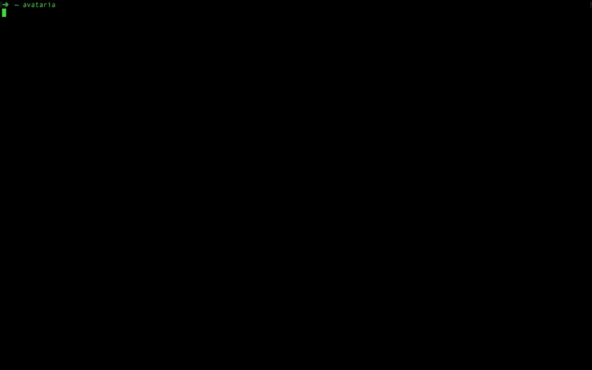
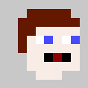
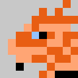

# Avataria

[](https://nodei.co/npm/avataria/)



This is a tool for randomly generating avatars for use in character sheets.

## Installation

You will need [node](https://nodejs.org/en/) and [npm](https://www.npmjs.com/) installed. Then do:

`npm install -g avataria`

## Generate an Avatar

`avataria`

Once you have installed avataria you can generate an avatar by simply running the following:

## Options

### Species

`avataria --species human`

Currently there are two species available, __human__ and __dragonborn__.




### Gender

`avataria --gender male`

You can specify a gender by setting either `male` or `female` (or for convenience `m` / `f`)

## Module Usage

```javascript
const avataria = require('avataria');

// specify options, none are required
const options = {
  species: 'human',
  gender: 'male',
  hair: 'brown',
  skin: 'pale',
  eye: 'blue'
};

// call the method
avataria(options, (err, results) => {
  const { raw, base64, ascii } = results;
  console.log(ascii);
});
```

### Options

- __Species__: defaults to random, you can set the species to either __dragonborn__ or __human__
- __Gender__: defaults to random, you can set the gender to either __male__ or __female__
- __Size__: defaults to `128`, unit is pixels
- __Hair__: defaults to random, you can input a hair color that is available (see data/__species__-colors.json)
- __Skin__: defaults to random, you can input a skin color that is available (see data/__species__-colors.json)
- __Eye__: defaults to random, you can input a eye color that is available (see data/__species__-colors.json)

### Output

- __raw__: This is the raw PNG buffer
- __base64__: This is the buffer converted to base64 for usage in `data:image/png;base64`
- __ascii__: An ASCII representation of the avatar

## License

[MIT](https://github.com/opendnd/avataria/blob/master/LICENSE)