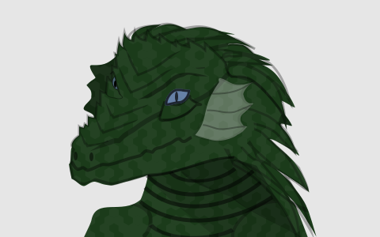
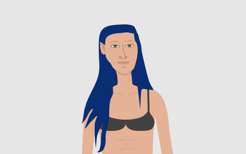

# Avataria

[](https://nodei.co/npm/avataria/)

This is a tool for randomly generating avatars for use in character sheets.

## Installation

You will need [node](https://nodejs.org/en/) and [npm](https://www.npmjs.com/) installed. Then do:

`npm install -g avataria`

## Generate an Avatar

`avataria`

Once you have installed avataria you can generate an avatar by simply running the following:

## Options

### race

`avataria --race human`

Currently there are 9 race available:

#### Dragonborn


#### Dwarf


#### Elf


#### Gnome


#### Half-Elf


#### Half-Orc


#### Halfling


#### Human


#### Tiefling


### Gender

`avataria --gender male`

You can specify a gender by setting either `male` or `female`

## Module Usage

```javascript
const Avataria = require('avataria');

// specify options, none are required
const opts = {
  race: 'Human',
  gender: 'male',
};

// call the method
const avataria = new Avataria();
const avatar = avataria.generate(opts);
```

### Options

- __Race__: defaults to random, you can set the race to any available
- __Gender__: defaults to random, you can set the gender to either __male__ or __female__

## License

[MIT](https://github.com/opendnd/avataria/blob/master/LICENSE)